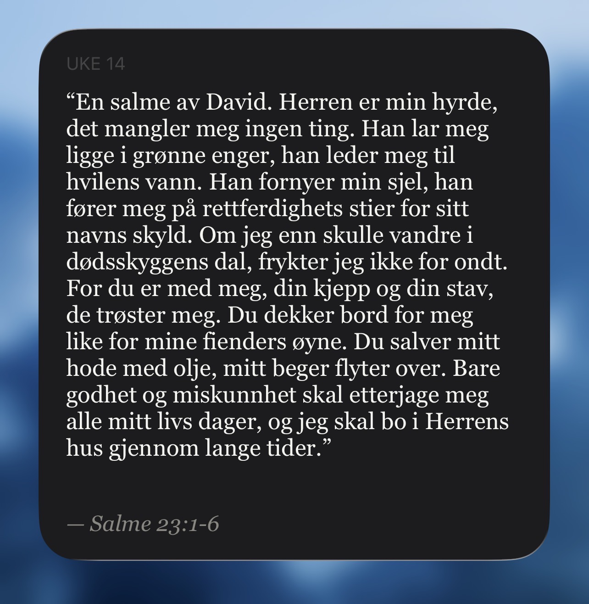

# Ukas puggevers iOS-widget



En iOS-widget som viser ukas puggevers. Bygget med [Scriptable](https://scriptable.app/), som lar deg kjøre JavaScript-skript direkte i iOS-widgets.

Verslisten er basert på John MacArthur sin liste for "52 bibeltekster en kristen burde lære seg", med noen vers lagt til der det var naturlig. Listen starter på uke 14, siden det var da vi begynte med dette. Den dekker alle 52 uker. Har scrapet de vanligste norske oversettelsene (NB88/07, Bibel2011 bokmål og nynorsk, BGO). Vil du ha en annen, se Del 2.
> DISCLAIMER: Dobbeltsjekk verset mot bibelen hver uke, kan ikke garantere at det ikke har skjedd noen feil under scrapingen.

## Del 1 - Oppsett

1. Last ned [Scriptable](https://apps.apple.com/app/scriptable/id1405459188) fra App Store og åpne appen. Dette oppretter mappen `Scriptable` i iCloud Drive automatisk.
2. Last ned `ukas_puggevers_widget.js` og ønsket `scraped_verses/[oversettelse].json` (vil du ha en annen oversettelse, se Del 2).
3. Legg begge filene i **iCloud Drive → Scriptable** (via Filer-appen).
4. Gi vers-filen nytt navn til `bibelvers.json`.
5. Legg til en **4x4** (stor) Scriptable widget på hjemskjermen. Trykk på widgeten, velg **Rediger widget**, og sett **Script** til **ukas_puggevers_widget**.

### Endre skriftstørrelse (valgfritt):
Skriftstørrelsen er testet på iPhone 13 Pro Max. Skriftstørrelsen vil til en viss grad kunne tilpasse seg automatisk, men hvis du har en mindre iPhone og hele teksten ikke vises (eller du vil ha større tekst), må du endre skriftstørrelsen.
Åpne `ukas_puggevers_widget.js` i Scriptable og juster konstantene øverst i filen. `large` brukes for 4×4-widgeten.

```js
const BODY_SIZE = { small: 14, medium: 15, large: 16 };
const REF_SIZE  = { small: 13, medium: 14, large: 15 };
```
**Tips:** Den lengste bibelteksten i denne listen er Salme 23, som er i uke 46. Hvis du i scriptet midlertidig bytter ut linje 83
```
const week = weekNumber(new Date());
``` 
med 
```
const week = 46 //weekNumber(new Date());
```
kan du se om Salme 23 får plass på widgeten din. Hvis du stiller skriftstørrelsen til denne får plass, vet du at alle andre også vil få plass.

---

## Del 2 - Scrape en ny oversettelse

Scraperen er et eget Python-prosjekt (lenke kommer). Du trenger filene derfra for å bruke `fill_json.py` i dette repoet.

>OBS! Noen oversettelser tar ikke med intro-verset i salmene (f.eks. "Av David") som vers 1. Da forskyves versintervallet med 1 og må rettes manuelt i JSON-filen.

### Bruk

Lag en kopi av `scraped_verses/template.json` og gi den et nytt navn. Finn oversettelsens ID på [bible.com/versions](https://www.bible.com/versions) (tallet i URL-en). Kjør så:

```bash
python fill_json.py --file [filsti til .json som skal fylles inn] --translation-id [id]
```

Allerede hentede vers hoppes over, så du kan stoppe og fortsette uten å miste fremgang.

Når scrapingen er ferdig, kopier filen til Scriptable-mappen i iCloud Drive og gi den nytt navn til `bibelvers.json`.

---

## Takk til

- Claude Code
