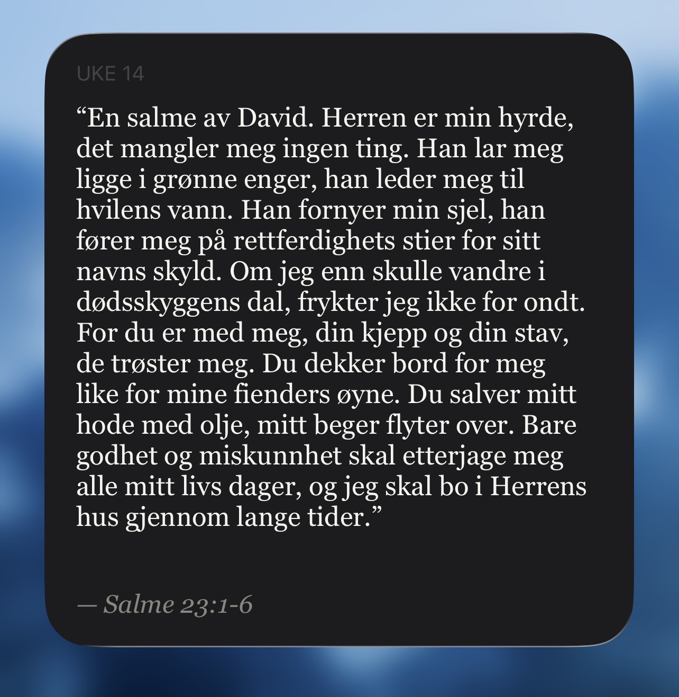

# Ukas puggevers iOS-widget



En iOS-widget som viser ukas puggevers. Bygget med [Scriptable](https://scriptable.app/), som lar deg kjøre JavaScript-skript direkte i iOS-widgets.

Verslisten er basert på John MacArthur sin liste for "52 bibeltekster en kristen burde lære seg", med noen vers lagt til der det var naturlig. Listen starter på uke 14, siden det var da vi begynte med dette. Den dekker alle 52 uker. Har scrapet de vanligste norske oversettelsene (NB88/07, Bibel2011 bokmål og nynorsk, BGO). Vil du ha en annen, se Del 2.
> DISCLAIMER: Dobbeltsjekk verset mot bibelen hver uke, kan ikke garantere at det ikke har skjedd noen feil under scrapingen.

## Del 1 - Oppsett

1. Last ned [Scriptable](https://apps.apple.com/app/scriptable/id1405459188) fra App Store og åpne appen. Dette oppretter mappen `Scriptable` i iCloud Drive automatisk.
2. Last ned `ukas_puggevers_widget.js` og ønsket `scraped_verses/[oversettelse].json` (vil du ha en annen oversettelse, se Del 2).
3. Legg begge filene i **iCloud Drive → Scriptable** (via Filer-appen).
4. Gi vers-filen nytt navn til `bibelvers.json`.
5. Legg til en **4x4** (stor) Scriptable widget på hjemskjermen. Trykk på widgeten, velg **Rediger widget**, og sett **Script** til **ukas_puggevers_widget**.

### Endre hvilken oversettelse som åpnes i bibel-appen (valgfritt)

Widgeten har en knapp som åpner ukas tekst i YouVersion-appen (eller nettsiden hvis du ikke har appen). Oversettelsen som skal åpnes må spesifiseres. Default er Norsk Bibel 88/07, men dette kan enkelt endres.

1. Åpne Scriptable appen, finn `ukas_puggevers_widget.js` og trykk på de 3 prikkene på boksen. Scriptet åpnes i editoren.
2. Finn variabelen `const BIBLE_ID = 102;` på toppen av filen
3. Bytt ut **bare tallet** (`102`) med ID-en til ønsket oversettelse:

| Oversettelse | ID |
|---|---|
| Norsk Bibel 88/07 (NB88) | `102` |
| Bibelen Guds Ord (BGO) | `2216` |
| Bibel 2011 bokmål | `29` |
| Bibel 2011 nynorsk | `119` |

---

ID-er til andre oversettelser kan finnes ved å gå til [bible.com/versions](https://bible.com/versions) og finne tallet i URL-en, f.eks. `https://www.bible.com/versions/102-nb-norsk-bibel-8807` → ID `102`

## Del 2 - Scrape en ny oversettelse

Scraperen er et eget [Python-prosjekt](https://github.com/tobiashellerslien/bible-scraper). Du trenger filene derfra for å bruke `fill_json.py` i dette repoet.

>OBS! Noen oversettelser tar ikke med intro-verset i salmene (f.eks. "Av David") som vers 1. Da forskyves versintervallet med 1 og må rettes manuelt i JSON-filen.

### Bruk

Lag en kopi av `scraped_verses/template.json` og gi den et nytt navn. Finn oversettelsens ID på [bible.com/versions](https://www.bible.com/versions) (tallet i URL-en). Kjør så:

```bash
python fill_json.py --file [filsti til .json som skal fylles inn] --translation-id [id]
```

Allerede hentede vers hoppes over, så du kan stoppe og fortsette uten å miste fremgang.

Når scrapingen er ferdig, kopier filen til Scriptable-mappen i iCloud Drive og gi den nytt navn til `bibelvers.json`.

---

## Takk til

- Claude Code
